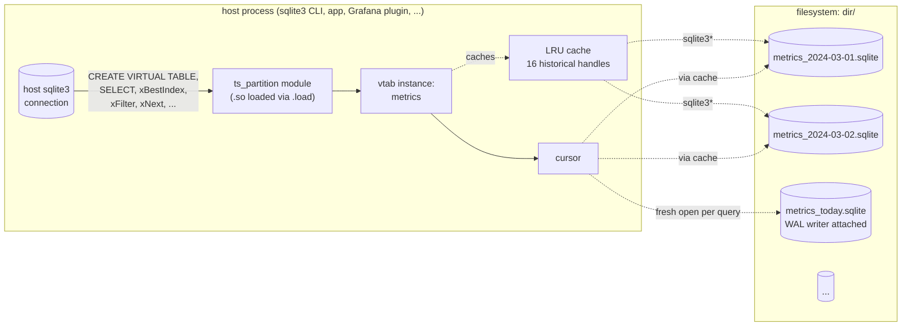
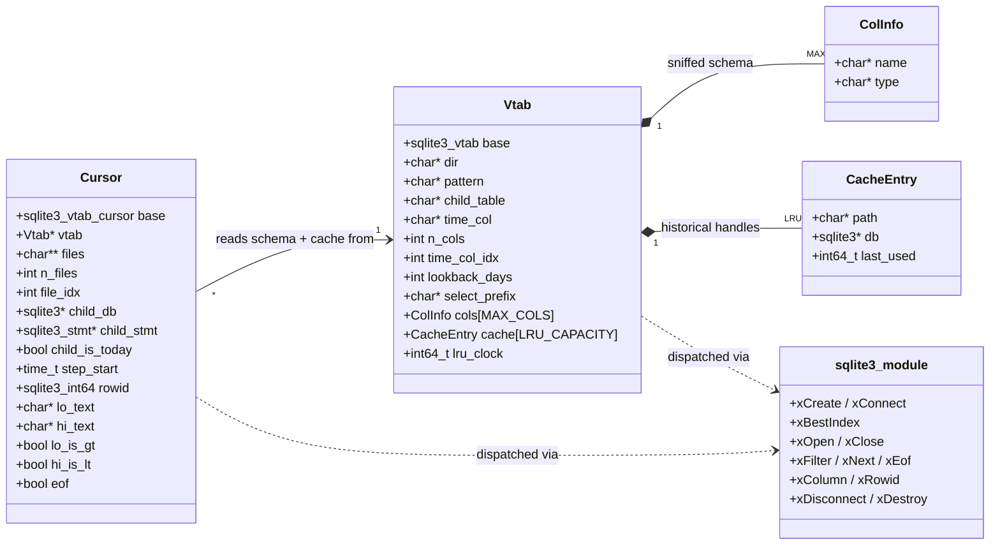
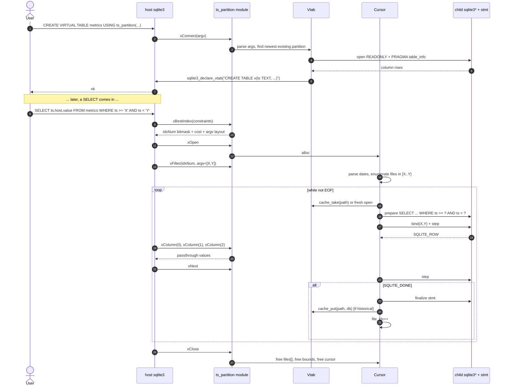
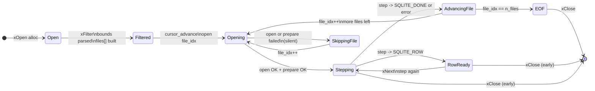
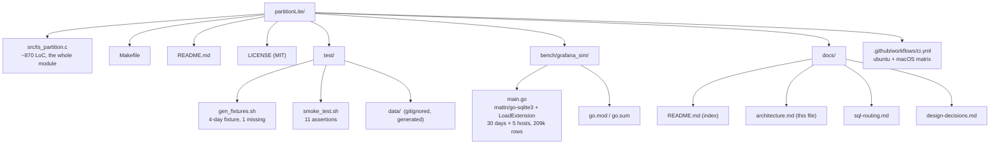

# Architecture

`ts_partition` is a SQLite **loadable extension** that registers a
single **virtual-table module** named `ts_partition`. The host process
(any SQLite3 — CLI, your app, a cgo-based Grafana plugin) loads the
`.so`, the module's init function registers an `sqlite3_module`
function table, and from then on `CREATE VIRTUAL TABLE foo USING
ts_partition(...)` creates an instance that fans queries out across
sibling `.sqlite` files.

This document covers the runtime topology, the in-memory types, the
query lifecycle, and the cursor state machine. SQL routing — how a
single `SELECT` becomes N child `SELECT`s — lives in
[sql-routing.md](./sql-routing.md).

## Runtime topology

Every parent SQL statement runs inside the host connection. The vtab
module receives callbacks and, internally, opens **additional**
`sqlite3*` handles — one per partition file actively being read. These
are private; the host never sees them. Today's file is always opened
fresh per query so a Grafana refresh sees the latest WAL state from
the writer. Historical files are pooled in a 16-slot LRU on the vtab
to amortize open cost across panel refreshes.

## In-memory types

Two structs carry per-vtab and per-cursor state. Both inline a SQLite
base struct (`sqlite3_vtab` / `sqlite3_vtab_cursor`) as their first
field so the cast between SQLite's pointer and ours is free. The Vtab
owns the LRU; cursors borrow from it. A cursor's `child_db` /
`child_stmt` pair is the active partition file at any given moment —
the cursor walks `files[]` left-to-right, opening one file at a time.

## Query lifecycle

The four interesting phases:

1. **Connect (once per `CREATE VIRTUAL TABLE`).** Parse args, walk
   back from today to find the first existing partition, run `PRAGMA
   table_info` on it, declare the matching schema to the host.

2. **Plan (once per query).** xBestIndex inspects `ts_col`
   constraints, encodes which were captured into `idxNum`, and
   reports a low cost only when bounds were found — so the planner
   reliably hands us the bounds.

3. **Filter (once per query).** Cursor receives bound values from
   `argv`, parses them as dates, enumerates files to open, then steps
   the first one.

4. **Iterate (many times per query).** xNext steps the active child
   statement; on `DONE`, it closes (or returns to cache), increments
   `file_idx`, and prepares the next file.

## Cursor state machine

Every state transition out of `Stepping` either yields a row to the
host or releases the active child and moves to the next file. The
`SkippingFile` state is the silent-skip path — open or prepare
failures on a single partition never propagate out of the module.

## Module function table

```mermaid
flowchart LR
    subgraph Vtab["sqlite3_module ts_module"]
        direction TB
        x1[xCreate / xConnect → tsConnect]
        x2[xBestIndex → tsBestIndex]
        x3[xDisconnect / xDestroy → tsDisconnect]
        x4[xOpen → tsOpen]
        x5[xClose → tsClose]
        x6[xFilter → tsFilter]
        x7[xNext → tsNext]
        x8[xEof → tsEof]
        x9[xColumn → tsColumn]
        x10[xRowid → tsRowid]
        x11["xUpdate, xBegin,<br/>xRename, xFindFunction,<br/>... → nullptr"]
    end

    init[sqlite3_tspartition_init] --> reg[sqlite3_create_module<br/>name='ts_partition']
    reg --> Vtab
```

Only the methods needed for read-only iteration are filled in.
Everything else is `nullptr`, which SQLite interprets as "not
supported" — the host raises a normal `cannot modify` error if a user
ever tries to write through the vtab.

## File layout

The entire shipping extension is one C file plus a Makefile; the
tests and the benchmarking harness live alongside but are independent
builds.
