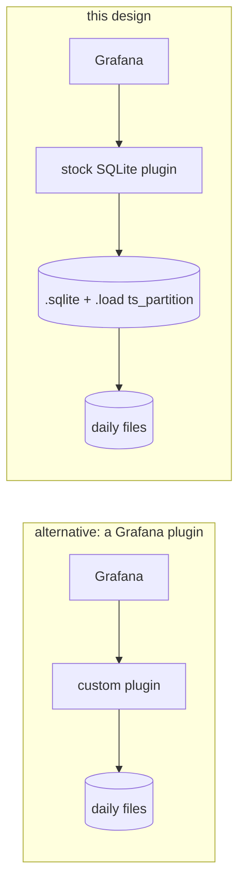
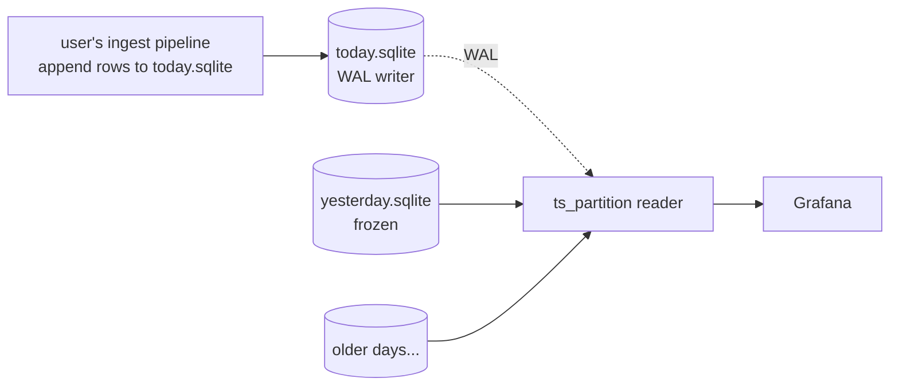
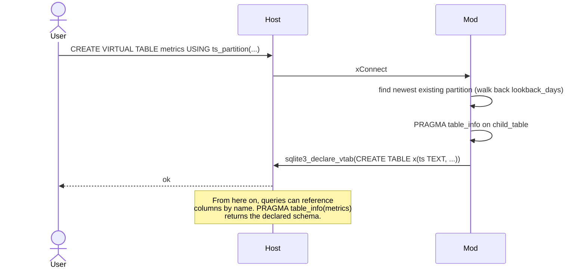
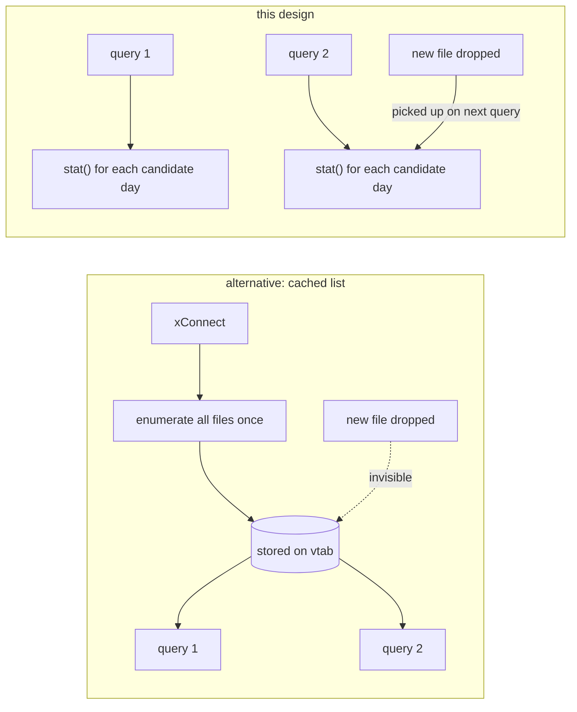
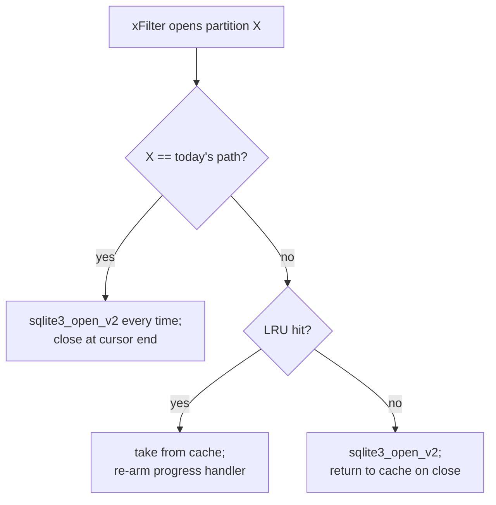
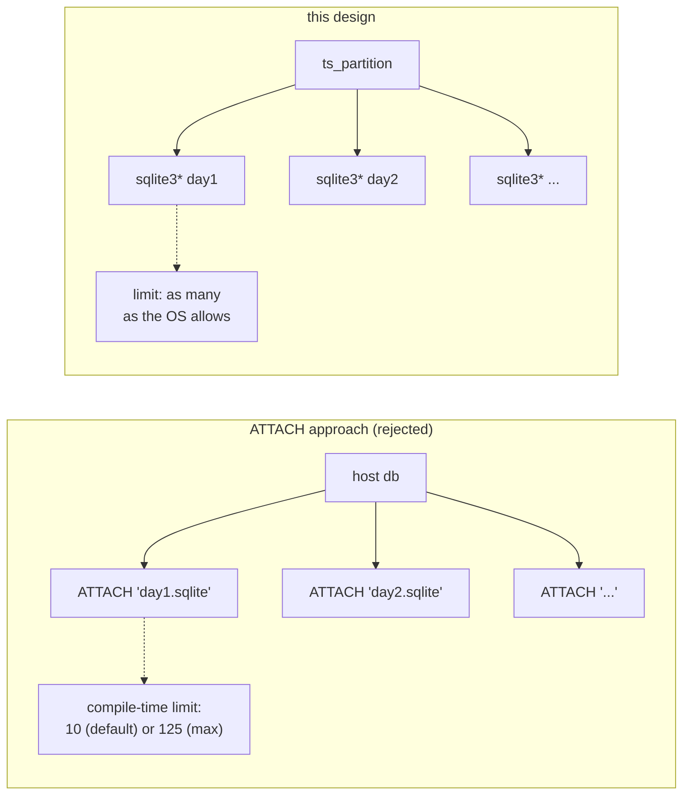
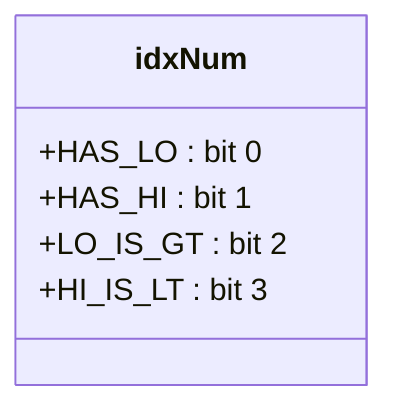
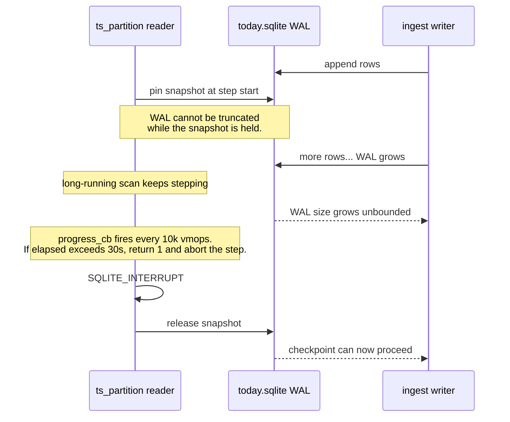

# Design decisions

A log of the non-obvious choices and the reasoning behind them. The
goal here is to make every "why doesn't it do X?" question answerable
without re-deriving the trade-off.

## Why a virtual table, not a Grafana plugin?

A Grafana plugin would require rewriting query translation (panels →
plugin RPC → SQL → result frames) and re-implementing macros like
`$__timeFilter` and `$__timeGroup` that already work in the SQLite
plugin. A virtual table inverts the burden: from the panel's
perspective the table is normal SQLite, every macro works, and the
plugin only needs to load the `.so` once.

The catch is that the shipping `frser-sqlite-datasource` plugin moved
to a pure-Go SQLite backend (`modernc.org/sqlite`) at v3.0, which has
no `sqlite3_load_extension`. That's documented in the main README
under *Compatibility note*. The headless harness in `bench/grafana_sim/`
validates the same runtime path a cgo plugin would take.

## Why read-only?

Two reasons:

1. **Writes are out of scope.** The user already has an ingest tool
   that knows their schema and produces one daily `.sqlite`. The vtab
   exists to read history; it doesn't need a write path.
2. **No xUpdate keeps the surface small.** Read-only avoids the
   transaction machinery (`xBegin` / `xCommit` / `xSync`), and the
   `nullptr`s in the module table cause SQLite to raise a clean
   "cannot modify" error on any write attempt.

## Why sniff the schema at xConnect, not lazily?

`sqlite3_declare_vtab` must be called inside `xConnect`. The host
needs the column list to plan any subsequent query.

Sniffing from the **newest** file (rather than the oldest, or all
files) trades two things:

- **Pro:** the schema reflects the current shape if columns were added
  over time. If you add a column in 2024, the 2024-onwards files
  determine the declared schema.
- **Con:** older files lacking a recently-added column will fail
  `prepare` and be silently skipped. We picked this trade because
  forward schema evolution is the normal direction; a missing column
  in old files is a real situation that should be surfaced (as zero
  rows from those files) rather than blocking the table from opening.

## Why rediscover the file list every query?

The alternative is to enumerate files once at `xConnect` and cache the
list on the Vtab. We don't, because:

- Append-only ingest drops a new daily file every midnight. With a
  cached list, that file is invisible until the host restarts.
- Operators sometimes prune old files manually. With a cached list,
  the reader would either error on stat-failure inside `xFilter` or
  the missing file would persist as a phantom in the list.
- `stat()` of ~30 candidate paths costs microseconds. Not worth
  caching.

## Why an LRU only for historical files, never today's?

Each `sqlite3_open_v2` does several real I/Os: open(2), read the
header, set up the page cache, attach the WAL file if present. For a
dashboard refreshing every 5 seconds across a 30-day range, opening
30 handles per refresh is wasteful — most of them point at files
that haven't changed since last time.

But today's file *is* changing under our feet. We deliberately
re-open it on every query so we observe the latest WAL state. A
cached handle could be sitting on a stale snapshot.

The capacity (16) matches the typical "scan the recent week or two"
pattern. A dashboard showing 7 days × 24h panels reads ~7 files per
refresh; the cache holds those plus a few one-offs.

## Why no ATTACH?

SQLite's ATTACH limit is compile-time: 10 by default, 125 maximum.
Five years of daily files is ~1825. Even one year is ~365. We open
separate `sqlite3*` handles per partition, bypassing the limit
entirely. (And each child handle has its own page cache, which is
actually *better* than ATTACH for files that are touched separately.)

## Why omit = 0 in xBestIndex?

Setting `omit = 1` tells SQLite "trust the vtab — don't re-check this
row against the constraint". We don't claim that because:

- Users mix bare dates and ISO 8601 forms; lexical comparisons aren't
  always equivalent.
- The child file's index might use a different collation than the
  parent.
- The re-check cost at the host is negligible (a string compare per
  row).

The price for `omit = 0` is small enough that the safety win
dominates.

## Why a bitmask `idxNum` instead of `idxStr`?

`idxNum` is an int the host carries verbatim from `xBestIndex` to
`xFilter`. Four bits encode everything xFilter needs to know about the
captured constraints. `idxStr` allocates a string and adds a
malloc/free dance for no benefit when the encoding fits in a few
bits.

If we ever need to carry richer plan data (e.g. column-specific
filters), the bitmask can grow to 32 bits and we still won't need
`idxStr`.

## Why a 30-second progress-handler budget?

A read-only cursor pins the writer's WAL snapshot. If a runaway scan
holds it for hours, the WAL file grows without bound and the writer
can't checkpoint. Capping each query at 30 seconds gives the writer a
hard upper bound on snapshot duration.

30 s is generous for any reasonable Grafana panel. A panel that
legitimately needs longer should be split into smaller time windows.

The progress callback is re-armed against the **current cursor** on
every `cursor_open_current`, including cache hits, so a stale
pointer from a previous owner can't fire. We also clear it in
`cache_put` for defense in depth.

## Why the schema sniff must succeed before declare_vtab?

`sqlite3_declare_vtab` is final: once called, the column list is
locked for the life of the vtab. We can't sniff lazily, declare
later, or redeclare. So:

- If no partition file exists in the lookback window → fail
  `xConnect` with a clear message.
- If the declared `time_col` isn't in the sniffed schema → fail
  `xConnect` with a clear message.

This is the only place `ts_partition` raises an error to the parent —
everywhere else (open failures, prepare failures, query timeouts) is
silent-skip.

## Why store `select_prefix` on the Vtab, not rebuild it per query?

The select prefix (`SELECT "col1", "col2", ... FROM "child_table"`)
depends only on the sniffed schema, which is fixed for the life of
the vtab. Per-query allocation would be ~100 bytes of throwaway work
on every `xFilter`, which is fine but unnecessary.

The bound suffix (`WHERE "ts" >= ? AND "ts" < ?`) does vary, since
the operators depend on `idxNum`, and is built per-file inside
`cursor_open_current`.

## Why C23 — and what we kept vs dropped?

C23 idioms used:

- `nullptr` keyword (much cleaner than `NULL`)
- `[[nodiscard]]`, `[[maybe_unused]]` attributes
- `enum : int { ... }` for typed bitmask enums
- Digit separators (`2'000`, `1'000'000`)
- Conditional `<stdbool.h>` based on `__STDC_VERSION__`

C23 idioms **dropped** for Clang 18 compatibility:

- `constexpr int X = ...` → `enum : int { X = ... }`. Clang 18 has
  `-std=c23` but the `constexpr` keyword landed in Clang 19. The
  enum shape compiles everywhere and is morally the same thing.

The Makefile auto-detects whether the compiler accepts `-std=c23`
and falls back to `-std=c2x` for GCC 13.

## Why no Windows support beyond the dllexport?

The user's spec scoped the deliverable to Linux + macOS for Grafana.
Windows builds *should* work — the `__declspec(dllexport)` is in
place, the rest is portable C — but CI doesn't exercise it, and
manual smoke testing on Windows hasn't happened. Treat it as
best-effort; PRs welcome.
