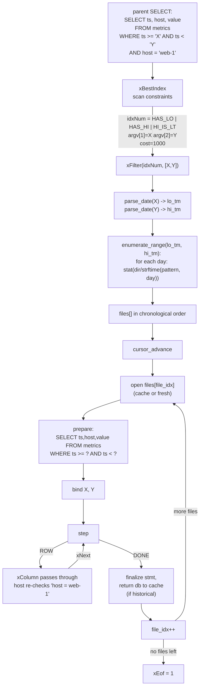
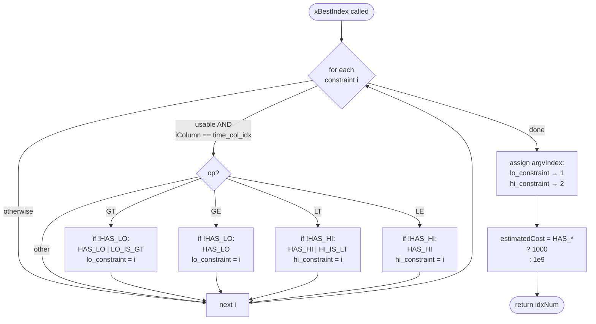
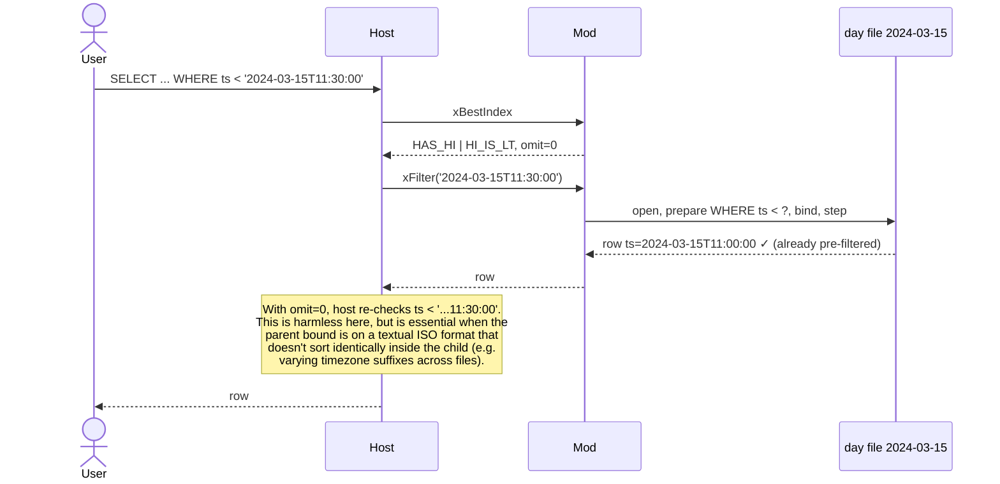
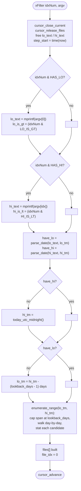
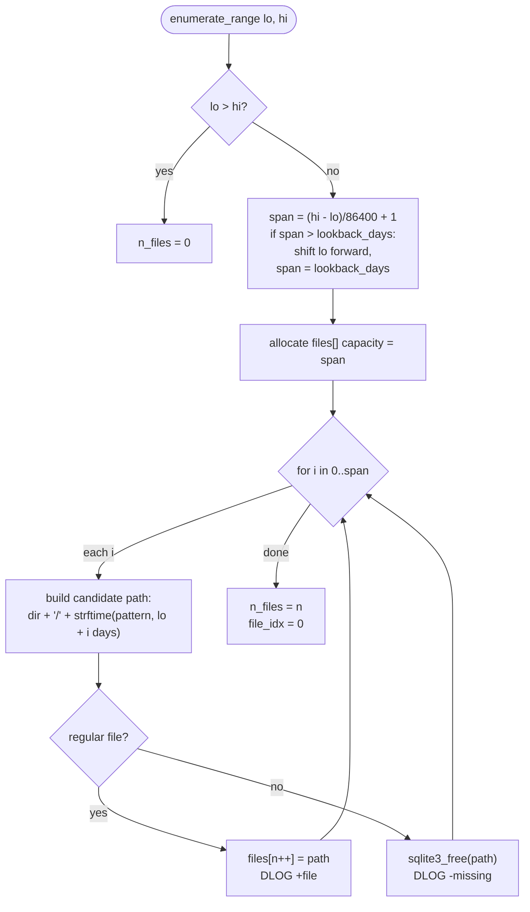
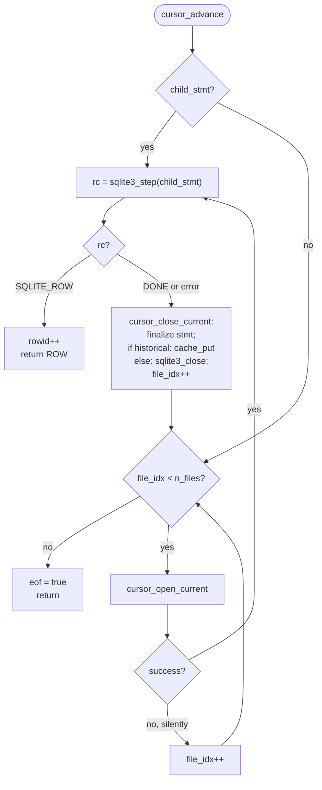
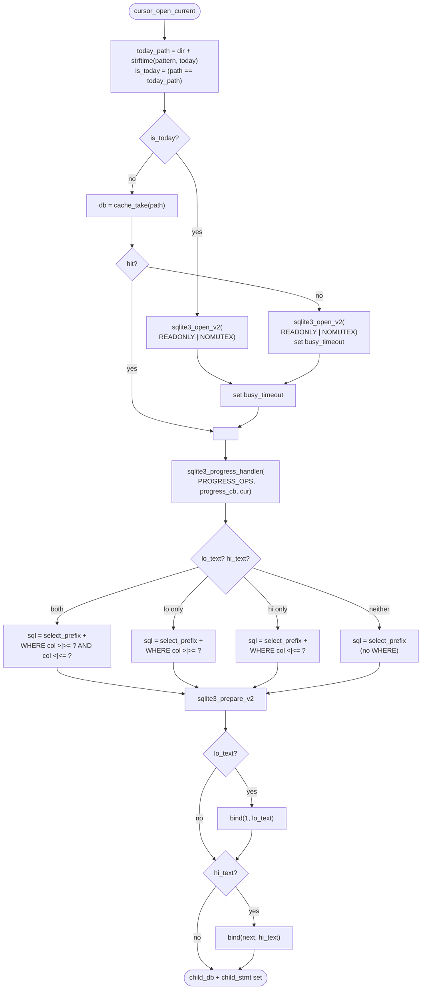
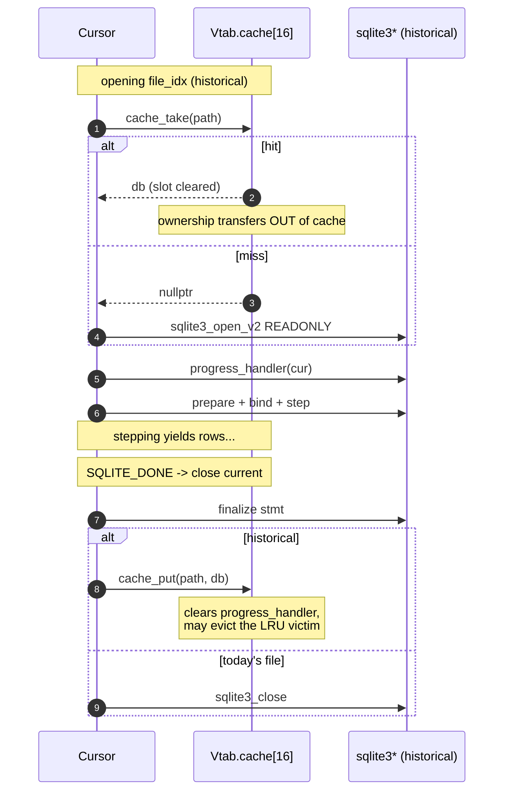
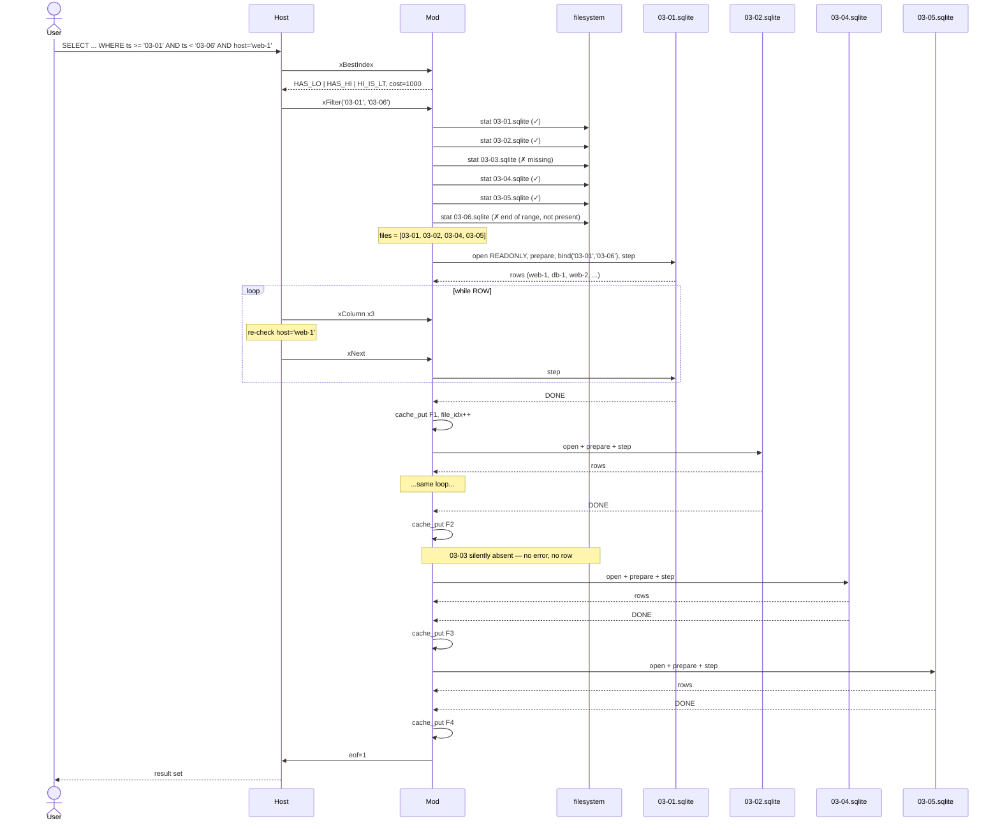

# SQL routing

This document walks through how a single `SELECT` against the
virtual table becomes N `SELECT`s against the underlying partition
files. There are three pieces:

1. **xBestIndex** — the planner asks "which constraints can you
   use?". We answer with a bitmask describing what bounds we
   captured, and assign argv positions so xFilter gets them.
2. **xFilter** — we receive the bound values, parse them as dates,
   enumerate files in the matching directory window, and start the
   first child statement.
3. **xNext** — we step the active child statement, and on `DONE` we
   close it and open the next file in the list.

The end-to-end flow:



The host evaluates non-time predicates (`host = 'web-1'`) as a normal
post-filter on the rows we hand back. We don't push down arbitrary
expressions because the parent-side index machinery already does that
work; only `time_col` gets special treatment because it's the column
that drives **file selection**, not just row selection.

## xBestIndex: constraint scan and bitmask encoding



The bitmask is four bits wide:

| bit       | name      | meaning                                  |
| --------- | --------- | ---------------------------------------- |
| `1 << 0`  | `HAS_LO`  | a lower bound on `time_col` was captured |
| `1 << 1`  | `HAS_HI`  | an upper bound on `time_col` was captured |
| `1 << 2`  | `LO_IS_GT`| if set, lower bound is strict (`>`); else `>=` |
| `1 << 3`  | `HI_IS_LT`| if set, upper bound is strict (`<`); else `<=` |

A *strict* bound carries through to the child SELECT: if the parent
said `ts > 'X'`, the child SELECT becomes `... WHERE ts > ?` (not
`>=`), so per-file pruning preserves the semantics exactly.

The cost figures (1e9 unbounded vs 1000 bounded) are large enough that
the planner reliably prefers handing us the bounds; we leave
`omit = 0` so SQLite still re-checks each row in case the bound is
intra-day.

### Why omit = 0?



Setting `omit = 1` would tell SQLite "trust the vtab — don't re-check
this row". We deliberately do *not* claim that, because:

- Some users mix bare dates (`'2024-03-01'`) and ISO 8601
  (`'2024-03-01T10:00:00Z'`); their lexical comparison varies.
- The child file's index on `time_col` is great for pruning but its
  collation could differ across day files.
- The cost of a double-check at the host is negligible.

## xFilter: from bounds to file list



Two fallback rules let the vtab give a sensible answer even when the
parent didn't filter by `time_col` at all:

- Missing upper bound → use today.
- Missing lower bound → use `today - lookback_days + 1`.

`lookback_days` defaults to 1825 (5 years) and is configurable per
vtab.

### File enumeration in detail



The directory is **re-scanned for every query**. There is no list
cache. This is deliberate: an ingest pipeline that drops a new day
file mid-session is picked up by the next panel refresh, no schema
reload required.

## Cursor advance: stepping through files



The loop is the heart of the routing logic. There are two exit
conditions:

- `SQLITE_ROW`: we hand control back to the host with a positioned
  row. `xColumn` and `xRowid` then read from `child_stmt`. The next
  `xNext` re-enters this function and steps again.
- All files exhausted: `eof = true`, the host stops calling `xNext`.

Open-or-prepare failures on a single file are **silent**: we
increment `file_idx` and continue. A corrupt or unreadable partition
file disappears from the result, never breaks the query.

## Push-down: building the per-file SELECT



The child SELECT is rebuilt per-file because the same bound text is
re-bound. We could cache the compiled SQL string on the vtab, but it
costs essentially nothing to rebuild and saves us tracking when bounds
changed across queries.

### Strictness propagation

| parent bound on `time_col` | child SELECT clause             |
| -------------------------- | ------------------------------- |
| `ts >= 'X'`                | `WHERE "ts" >= ?`               |
| `ts >  'X'`                | `WHERE "ts" >  ?`               |
| `ts <= 'Y'`                | `WHERE "ts" <= ?`               |
| `ts <  'Y'`                | `WHERE "ts" <  ?`               |
| `ts >= 'X' AND ts < 'Y'`   | `WHERE "ts" >= ? AND "ts" < ?`  |

This is intentional: Grafana's `$__timeFilter` macro emits a half-open
interval (`>=` lower, `<` upper), which is exactly the pattern that
maps cleanly onto contiguous day partitions.

## LRU cache interactions



A handle is **either** in the cache or **in a cursor** — never both.
`cache_take` removes the entry; `cache_put` reinserts. This invariant
means eviction during use is impossible: cache_put only sees handles
nobody is currently iterating.

Today's file is excluded from the cache entirely so each query opens
it fresh and observes the writer's latest WAL state.

## Concrete walkthrough

Given the fixture `/data` with files for `2024-03-01`, `2024-03-02`,
`2024-03-04`, `2024-03-05` (note: 03-03 missing), and a parent query:

```sql
SELECT ts, host, value
  FROM metrics
 WHERE ts >= '2024-03-01' AND ts < '2024-03-06'
   AND host = 'web-1';
```

Step by step:



A re-run of the same query now hits the cache for all four files —
no `sqlite3_open_v2` calls, no schema parsing — and serves the result
out of pre-warm handles.
